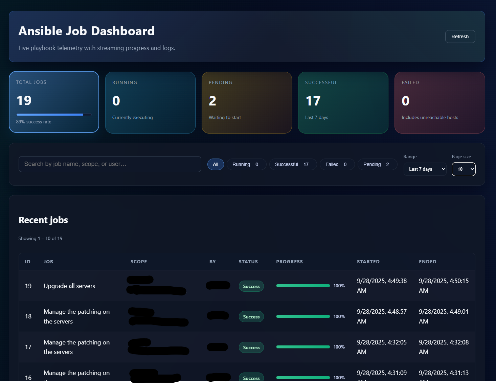
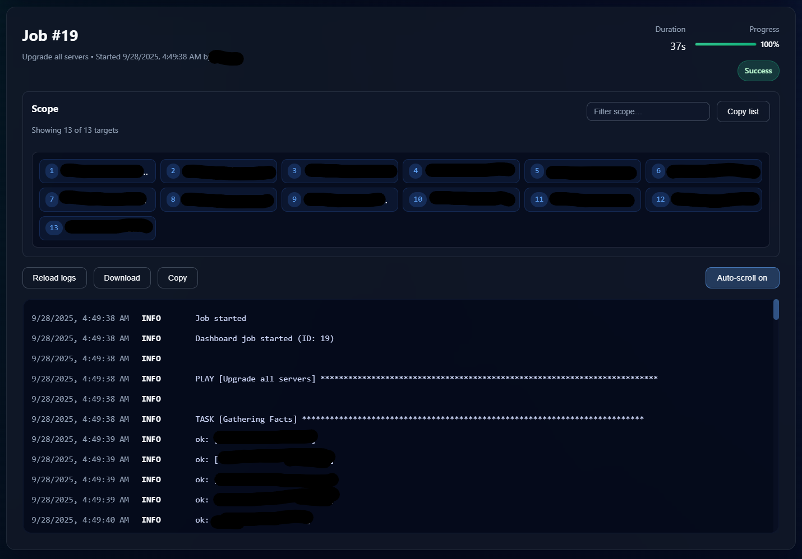

# Ansible Job Dashboard

A compact observability stack for Ansible playbooks. The FastAPI backend stores job metadata and log lines, the React frontend streams live updates over WebSocket, and the bundled Ansible callback plugin ships stdout directly to the dashboard.

## Highlights

- 🔄 **Live telemetry** – jobs appear instantly with progress, status chips, and auto-updating metrics.
- 📜 **Full log history** – fetch or stream the entire playbook log with download, copy, and auto-scroll controls.
- ⚙️ **Smart callback plugin** – optional job auto-creation, metadata injection, bearer auth, and TLS toggles configured via environment variables.
- 🐳 **Easy to run** – use the macOS 26-native `container` CLI or Docker Compose; local dev stays simple either way.

## Screenshots




## Run on macOS 26 native containers (not fully tested!!!)

If you're on macOS 26 (Apple silicon), follow [`docs/macos-container.md`](docs/macos-container.md) to build the images with Apple's first-party `container` CLI, create the named volume for SQLite, and run both services without Docker.

## Quick start with Docker Compose

```bash
cd ansible-job-dashboard
docker compose up --build
```

Then open http://localhost:3000. The frontend proxies API calls to the backend on port 8000.
The backend stores its SQLite database inside the named `backend_data` volume at `/app/data/database.db`.
Remove it with `docker volume rm ansible-job-dashboard_backend_data` if you need a fresh instance.

Compose details:

- Service names: `backend` (FastAPI) and `frontend` (NGINX serving the React build)
- Web UI: http://localhost:3000
- API: http://localhost:8000 (proxied from the frontend at `/api`)
- WebSocket: ws://localhost:3000/ws (proxied to the backend)
- Persistent data: Docker volume `backend_data` mounted at `/app/data`

## Manual development workflow

### Backend

```bash
cd ansible-job-dashboard/backend
python -m venv .venv && source .venv/bin/activate
pip install -r requirements.txt
uvicorn app.main:app --reload --host 0.0.0.0 --port 8000
```

This starts the FastAPI app with SQLite storage in `backend/database.db` (default `DATABASE_URL=sqlite:///./database.db`).

### Frontend

```bash
cd ansible-job-dashboard/frontend
npm install
npm run start
```

Parcel serves the React dashboard at http://localhost:3000.

Important: the frontend expects the backend on the same origin (`/api` and `/ws`). For local manual dev you have two options:

- Preferred: use Docker Compose for the frontend so NGINX proxies `/api` and `/ws` to the backend.
- Or run a simple reverse proxy on localhost:3000 that forwards `/api` and `/ws` to `http://localhost:8000`.

If you do neither, calls to `/api` from the dev server will 404 and WebSocket connection will fail.

## Integrating the Ansible callback

The Ansible callback plugin is mandatory for the app to work. Without it, the dashboard will not receive jobs or logs.

This repository ships the plugin at `ansible/callback_plugins/dashboard_log.py` (with optional `dashboard.env`) and an example configuration at `ansible/ansible.cfg`.

To enable the plugin you can either:

1) Use the bundled example config

- Run your playbooks from the `ansible/` directory (so relative paths in the config resolve), or set `ANSIBLE_CONFIG` to `ansible/ansible.cfg`.
- The example already sets `callback_plugins = ./callback_plugins` and enables `dashboard_log` via `callbacks_enabled`.

2) Integrate into your own repo

- Copy `ansible/callback_plugins/` into your project, or set `ANSIBLE_CALLBACK_PLUGINS` to point at that folder.
- In your `ansible.cfg`, enable the plugin using `callbacks_enabled` (or `callback_whitelist` on older Ansible).

Example `ansible.cfg` snippet:

```
[defaults]
callback_plugins = ./callback_plugins
# For Ansible 2.14+:
callbacks_enabled = dashboard_log
# For older Ansible:
# callback_whitelist = dashboard_log
```

### Common environment variables

| Variable | Purpose | Default |
| --- | --- | --- |
| `DASHBOARD_URL` | Base URL for the dashboard API (`http://host:port`) | `http://localhost:8000` |
| `DASHBOARD_LOG_FILE` | Location of the Ansible stdout file to upload | `./ansible.last.log` |
| `DASHBOARD_METADATA_FILE` | JSON file with job metadata (`job_name`, `scope`, `triggered_by`, `job_id`, `dashboard_url`) | `./.dashboard_job.json` |
| `DASHBOARD_JOB_ID` | Provide an existing job ID instead of auto-creating one | _(unset)_ |
| `DASHBOARD_API_TOKEN` | Adds `Authorization: Bearer <token>` to API calls | _(unset)_ |
| `DASHBOARD_VERIFY_TLS` | Set to `false` to skip TLS verification | `true` |
| `DASHBOARD_AUTOCREATE_JOB` | When `true`, POST `/api/jobs/start` if no `job_id` exists | `true` |
| `DASHBOARD_CHUNK_SIZE` | Size of log chunks sent per request (minimum 512) | `7000` |
| `DATABASE_URL` (backend) | Override the backend's default SQLite path or point at another engine | `sqlite:///./database.db` |
| `BACKEND_CORS_ORIGINS` (backend) | Comma-separated origins allowed by CORS | `*` (dev) |
| `BACKEND_ORIGIN` (frontend/NGINX) | Where NGINX proxies `/api` and `/ws` | `http://backend:8000` |

The plugin honours custom stats set via `set_stats` inside the playbook and environment variables supplied at runtime; it no longer reads or writes helper files (`.dashboard_job_id`, `.dashboard_url`). If you keep a `dashboard.env` next to the plugin file, it will be read on each run for entries like `DASHBOARD_URL=`.

Tip: when running via Docker Compose, you usually don't need to export anything—the defaults work as the frontend proxies `/api` to the backend and the backend persists data to the `backend_data` volume.

Quick URL override (no env export):

- You can set `DASHBOARD_URL` inside `ansible/callback_plugins/dashboard.env` for a simple, one-line override:

  ```
  DASHBOARD_URL=http://localhost:8000
  ```

  This is handy when you have to switch dashboard endpoints on the fly without changing code or shell env. The plugin reads this file at the start of every play run, so changes take effect on the next run.

Precedence note: values from `ansible.cfg` options for the plugin can override defaults; environment variables take precedence over `dashboard.env` entries.

## API and WebSocket endpoints

Base URL defaults to `http://localhost:8000` (or via the frontend at `http://localhost:3000/api`).

- POST `/api/jobs/start` — create a job
  - Body: `{ "job_name": string, "scope": string, "triggered_by": string }`
  - Returns: `{ "job_id": number }`
- POST `/api/jobs/progress` — update progress and optionally append a log line
  - Body: `{ "job_id": number, "progress"?: number, "message"?: string, "level"?: string }`
- POST `/api/jobs/complete` — mark a job complete
  - Body: `{ "job_id": number, "status": "success" | "failed" | string, "message"?: string }`
- GET `/api/jobs?range=24h|7d|30d|all` — list recent jobs (default `24h`)
- GET `/api/jobs/{job_id}/logs?limit=100&offset=0` — retrieve logs oldest-first (`limit=0` to fetch all)
- WebSocket `/ws` — broadcasts `job_start`, `job_progress`, `job_complete`, and `job_log` events

## Test the API quickly

```bash
curl -s -X POST http://localhost:8000/api/jobs/start \
  -H "content-type: application/json" \
  -d '{"job_name":"demo","scope":"all","triggered_by":"you"}'

curl -s -X POST http://localhost:8000/api/jobs/progress \
  -H "content-type: application/json" \
  -d '{"job_id":1, "progress":42, "message":"Halfway"}'

curl -s -X POST http://localhost:8000/api/jobs/complete \
  -H "content-type: application/json" \
  -d '{"job_id":1, "status":"success"}'

# Optional: list jobs and fetch logs
curl -s 'http://localhost:8000/api/jobs?range=24h' | jq .
curl -s 'http://localhost:8000/api/jobs/1/logs?limit=0' | jq .
```

Check the dashboard UI to see the log entries and updated job status.

## Next steps

- Harden the backend with authentication and pagination for large log sets.
- Add automated tests for the callback plugin and frontend components.
- Document reverse proxy deployments (Traefik, NGINX) for production environments.

## Security notes

- Images and base OS versions in the Dockerfiles are pinned to patched releases to reduce CVEs.
- See `docs/security/vulnerability-report-2025-09-26.md` for the latest dependency scan summary.

